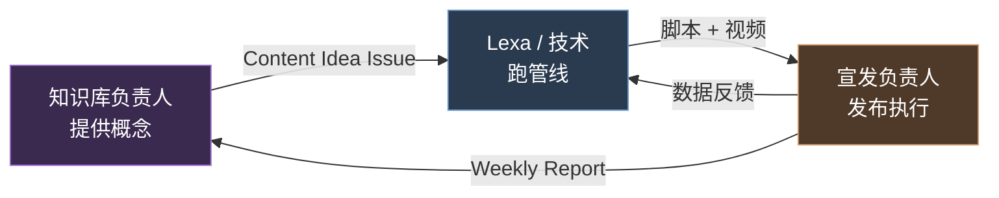

# Dayou 内容运营中台

把中国传统智慧稳定转成可发布的海外短视频。这里不讲代码，只讲谁负责、怎么交接、这一周做什么。

{: .important }
> **第一次来？** 直接看 [新人第一天](./day-one)，10 分钟搞定上手。

{: .important }
> **重要协作规则：clone 仓库本地用 `/daily` 看任务，但不要 push 到 main。** 所有团队成员都鼓励 clone 仓库 + 装 Claude Code，每天跑 `/daily` 看自己的任务。提交工作通过 GitHub Issues。详见 [协作规则](https://github.com/AlyciaBHZ/dayou-content/blob/main/CONTRIBUTING.md)。

## 三人协作总图

我们一共三个人。一个人提供输入（知识），一个人转化生产（技术），一个人对外发布（宣发）。每个人都在一个明确的环节，有明确的产出，有明确的交接点。

## 谁负责什么

| 角色 | 负责 | 不负责 | 主要工作区 |
|------|------|--------|------------|
| **Lexa**（AlyciaBHZ） | 内容管线、`pipeline.py`、`dayou.dev`、Vercel、HeyGen、n8n、策略 | 不长期写内容、不运营社媒、不替知识库做文化判断 | 终端、本仓库、Vercel |
| **知识库负责人**（TBD） | 每周概念、脚本审核、文化把关、知识库维护 | 不改代码、不部署、不跑管线、不管账号 | GitHub Issue、微信 |
| **宣发负责人**（TBD） | TikTok/Instagram 发布、Reddit 互动、数据跟踪、周报 | 不改代码、不部署、不替知识库做文化判断 | TikTok/Instagram/Reddit、GitHub Issue |

详细职责见 [角色说明](./roles)。

## 本周优先动作

| 角色 | 本周做什么 | 完成标准 |
|------|------------|----------|
| Lexa | 开通 HeyGen 创建 Avatar；跑通前 3 条视频端到端；配置 TikTok Business | 至少 3 条视频从概念走到成片，账号都可登录 |
| 知识库负责人 | 注册 GitHub；读 [CULTURAL_TRANSLATION.md](https://github.com/AlyciaBHZ/dayou-content/blob/main/CULTURAL_TRANSLATION.md)；提交首个 Content Idea Issue（含 3 个概念） | Issue 信息完整，可直接进入脚本生成 |
| 宣发负责人 | 注册 GitHub；开 TikTok/Instagram 账号；准备首批测试视频手动发布 | 两个账号可用，能手动发布并记录链接 |

完整任务清单见 [接下来 2 周](./next-steps)。

## 阅读路径

新加入按这个顺序读，30 分钟以内：

1. **第一天**：[新人第一天](./day-one) — 10 分钟从注册到能干活
2. **角色边界**：[角色说明](./roles) — 弄清楚自己负责什么、不负责什么
3. **每周节奏**：[每周工作流](./workflow) — 看交接顺序、异常处理、沟通规则
4. **本两周任务**：[接下来 2 周](./next-steps) — 看自己这两周交什么
5. **工具清单**：[工具清单](./tools) — 用到的所有平台和工具
6. **第一次用 GitHub？**：[GitHub 零基础入门](./github-beginner-guide)

## 现在就用哪些入口

| 目的 | 去哪里 | 输出什么 |
|------|--------|---------|
| 提交内容概念 | [新建 Content Idea Issue](https://github.com/AlyciaBHZ/dayou-content/issues/new?template=content-idea.md) | 1 个 Issue，含 2-3 个概念 |
| 审核脚本 | GitHub Issue + `workspace/scripts/` | 写明"通过 / 需改 / 拒绝"，指出具体句子 |
| 接收视频并发布 | GitHub Issue + 平台后台 | 发布链接、发布时间、异常记录 |
| 提交周报 | [新建 Weekly Report Issue](https://github.com/AlyciaBHZ/dayou-content/issues/new?template=weekly-report.md) | 数据 + 反馈 + 下周建议 |
| 紧急同步 | 微信 | 当天必须解决的事，30 分钟内补回 Issue |

## 相关资源

- [GitHub 仓库](https://github.com/AlyciaBHZ/dayou-content)
- [项目 README](https://github.com/AlyciaBHZ/dayou-content/blob/main/README.md)
- [运营手册 RUNBOOK](https://github.com/AlyciaBHZ/dayou-content/blob/main/RUNBOOK.md)
- [文化翻译规则](https://github.com/AlyciaBHZ/dayou-content/blob/main/CULTURAL_TRANSLATION.md)
