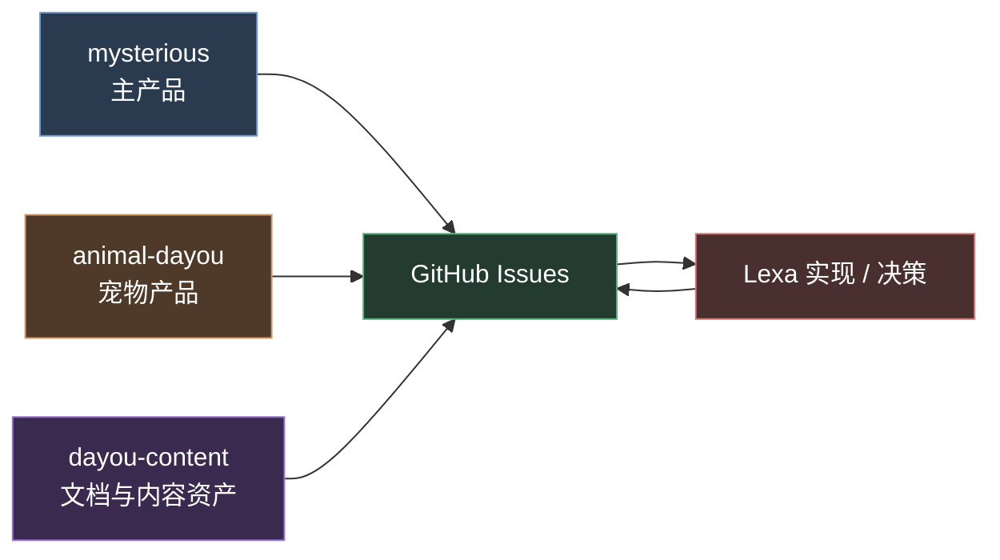

# Dayou 协作门户

这是 Dayou 三个核心仓库的统一协作入口。这里不假定你会写代码，也不假定你属于某个固定岗位。这里回答的是：项目现在在做什么、你该去哪个仓库、想法如何变成正式 Issue，再进入实现。

{: .important }
> **第一次来？** 先看 [每周工作流](./workflow)，再看 [GitHub 零基础入门](./github-beginner-guide)。默认协作方式是浏览器 + GitHub + AI，不需要本地开发环境。

{: .important }
> **核心规则：所有正式需求、反馈、决定都留在 GitHub Issue。** 微信只处理紧急情况；AI 或外部咨询先帮你把问题问清楚，但最终结论要回到 Issue。

## 三个核心仓库

这三个仓库同等重要，只是职责不同：

- `mysterious`：主产品，排盘、AI 解读、正式线上功能
- `animal-dayou`：宠物方向产品
- `dayou-content`：文档、内容资产、协作说明、团队手册

## 你该去哪个仓库

| 你现在的事情 | 应该去哪里 |
|------|------|
| 提产品功能、自动化、用户体验需求 | `mysterious` |
| 提宠物产品相关需求或反馈 | `animal-dayou` |
| 看团队手册、协作说明、内容文档 | `dayou-content` |
| 不确定归属，但需要正式留痕 | 先在最相关的仓库开 Issue，不确定就问 AI 后再决定 |

## 新协作工作流

1. 先看项目上下文：`README`、`TODO`、open Issues
2. 先问 AI 或外部咨询，把模糊想法整理清楚
3. 把整理后的内容提交成具体 GitHub Issue
4. Lexa 在 Issue 里判断是否做、何时做、怎么做
5. 实现、上线、验证都回到同一个 Issue 留痕

完整说明见 [每周工作流](./workflow)。

## 阅读路径

新加入按这个顺序读，20 分钟以内：

1. **仓库分工**：[仓库分工](./repo-scope) — 先判断你的事情属于哪个仓库
2. **工作流**：[每周工作流](./workflow) — 看想法如何进入系统
3. **GitHub 入门**：[GitHub 零基础入门](./github-beginner-guide) — 看如何注册、接受邀请、提 Issue
4. **工具清单**：[工具清单](./tools) — 看默认需要什么工具
5. **常见问题**：[FAQ](./faq) — 看权限、Issue、手机协作等问题

## 默认协作方式

| 你需要什么 | 默认做法 |
|------|---------|
| 了解当前进度 | 看目标仓库的 `TODO.md` 和 open Issues |
| 判断想法是否合理 | 先问 AI / gstack / 外部咨询 |
| 正式提出需求 | 开 GitHub Issue |
| 跟进结果 | 在原 Issue 里继续追踪 |
| 紧急问题 | 微信提醒，但之后补回 Issue |

## 相关资源

- [mysterious](https://github.com/DayouProject/mysterious)
- [animal-dayou](https://github.com/DayouProject/animal-dayou)
- [dayou-content](https://github.com/DayouProject/dayou-content)
