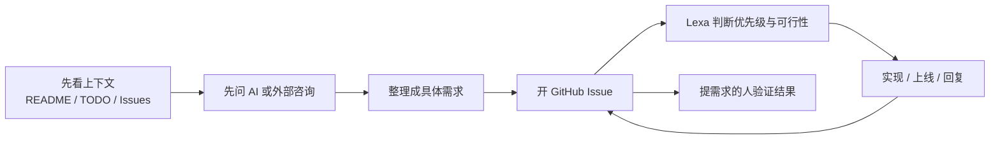

# 每周工作流

这套流程不再假定固定岗位，也不要求协作者懂代码。它适用于 Dayou 的三个核心仓库：`mysterious`、`animal-dayou`、`dayou-content`。

## 第零步：先判断属于哪个仓库

在走正式流程之前，先看 [仓库分工](./repo-scope.html)。

如果你连“这件事该进哪个仓库”都还没判断清楚，就不要急着开 Issue。先把归属判断做对，后面的讨论才不会跑偏。

## 目标

这套流程的目标是：

- 让所有 collaborator 都能知道项目现在在做什么
- 让不会写代码的人也能正式参与推进
- 让模糊想法先经过 AI 或外部咨询整理，再进入仓库
- 让每个需求都能留下清楚的上下文、决策和验收记录

## 标准流程

## 第一步：先看上下文

提任何需求之前，先看：

- 目标仓库的 `README.md`
- 目标仓库的 `TODO.md`
- 目标仓库当前 open Issues

目的不是让你研究代码，而是避免重复提需求，也避免提一个已经在做的东西。

## 第二步：先问 AI

如果你的想法还停留在“这个可以优化一下”，先不要开 Issue。

先问 AI 或外部咨询，把下面四件事问清楚：

1. 这个想法到底在解决什么问题？
2. 以现有技术栈，大概率能不能做？
3. 最小可交付版本是什么？
4. 什么结果才算 done？

如果你会用 gstack office hours，也可以作为这一步的一部分。但最终结论不要停留在聊天记录里，要整理后带回 GitHub。

## 第三步：再开 GitHub Issue

Issue 里至少要写清楚：

- 现在发生了什么问题，或者出现了什么机会
- 你想要的结果是什么
- 为什么现在值得做
- 证据、截图、链接、例子
- AI / gstack 对这个问题的判断
- 什么结果算 done

不要把多个不相干需求塞进一个 Issue。一个 Issue 最好只讲一件事。

## 第四步：Lexa 做技术判断

Lexa 会在 Issue 里给出其中一种判断：

- 可以做，进入实现
- 方向合理，但信息不够，需要补充
- 暂时不做，先留档
- 与当前目标不一致，明确搁置

这一步也应该留在 Issue，不要只在私聊里说。

## 第五步：实现和更新仍然回到同一个 Issue

如果开始实现，关键更新仍然回到原 Issue：

- 当前状态
- 相关分支、PR、commit
- 技术方案
- 上线说明
- 需要复核的点

## 第六步：提需求的人负责验证结果

需求是不是“真的被解决了”，不能只靠写代码的人自己判断。

最初提这个需求的人，需要回到同一个 Issue 里确认：

- 已满足
- 还差一点
- 方向对，但还要继续改

## 三个仓库怎么分工

| 仓库 | 主要用途 | 什么时候去这里 |
|---|---|---|
| `mysterious` | 主产品、排盘、AI 解读、正式线上功能 | 你的需求会影响主产品体验、功能、自动化、增长 |
| `animal-dayou` | 宠物方向产品 | 你的需求和宠物产品有关 |
| `dayou-content` | 团队手册、内容资产、协作说明 | 你需要看文档、流程、内容资产或协作规则 |

## 沟通规则

| 用什么 | 什么时候用 | 规则 |
|---|---|---|
| GitHub Issue | 正式需求、正式决定、长期跟踪、上线留痕 | 所有正式内容都要回到这里 |
| 微信 | 紧急情况、权限问题、生产事故、当天必须处理的事 | 微信上说完，尽快补回 Issue |
| AI / gstack | 整理问题、补上下文、判断可行性 | 不能替代最终留痕 |

## 默认不需要做的事

- 不需要 clone 仓库
- 不需要学 `git`
- 不需要安装 Node.js / npm
- 不需要安装 Codex CLI 或 Claude Code
- 不需要接触 Vercel
- 不需要本地运行项目

默认模式就是浏览器协作。

## 一个典型例子

如果你在 X 上发现“团队手动整理素材状态很慢，导致内容发布效率低”，正确做法不是直接私聊一句“能不能自动化”，而是：

1. 先看相关仓库的 `TODO.md` 和 open Issues
2. 先问 AI 或 gstack，这更像什么问题、第一版最小可以做到哪里
3. 把结论整理成具体 Issue
4. 在 Issue 里写清楚现状、目标、证据、done 标准
5. 如果技术上合理，再由 Lexa 决定是否实现

这样整个团队才能 truly stay on the same page。
